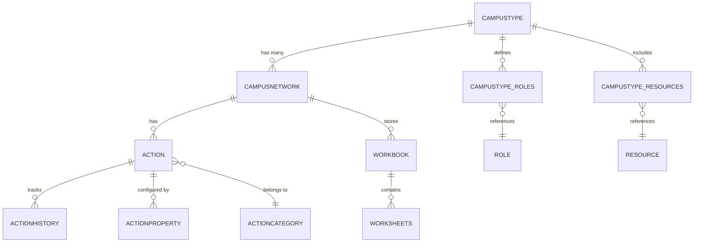
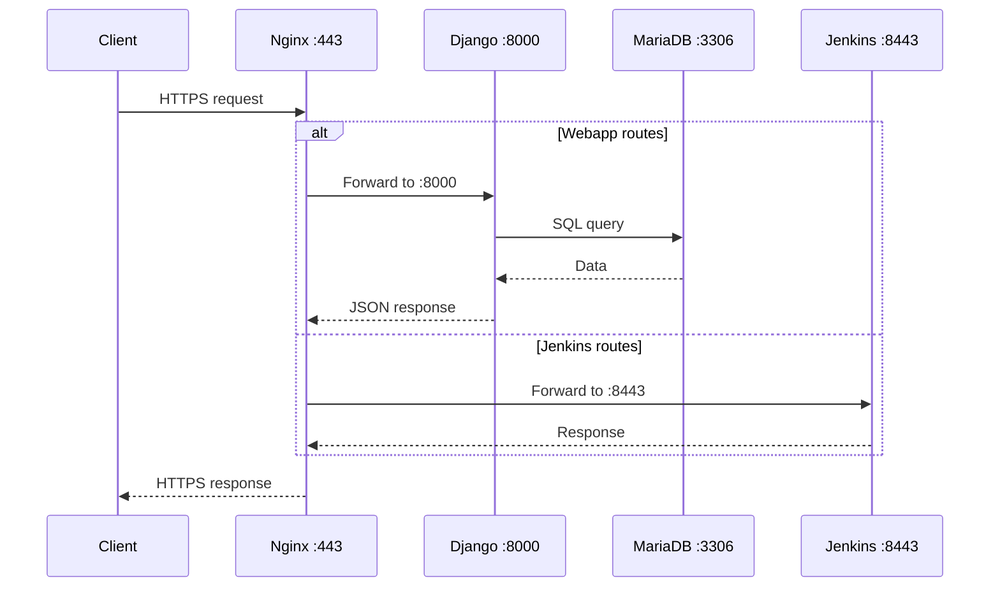

# :material-api: API Reference

NITA exposes functionality through the NITA Webapp's Django REST API and the Jenkins REST/CLI API. This page documents the available interfaces.

---

## NITA Webapp API

The NITA Webapp is built on Django and exposes a REST API for managing network types, networks, and configuration data. The API is accessed through the Nginx proxy at `https://<host>:443`.

!!! note "Assumption"
    The Webapp API endpoints are inferred from the Django database schema and Webapp functionality. For the most current API, inspect the Django URL configuration in the [nita-webapp repository](https://github.com/Juniper/nita-webapp).

### Authentication

The Webapp uses Django session authentication. Log in first to obtain a session cookie:

```bash
curl -k -c cookies.txt -X POST https://<host>/api/login/ \
  -d "username=vagrant&password=vagrant123"
```

### Network Types

| Method | Endpoint | Description |
|---|---|---|
| `GET` | `/api/network-types/` | List all network types |
| `POST` | `/api/network-types/` | Upload a new network type (zip file) |
| `GET` | `/api/network-types/<id>/` | Get network type details |
| `DELETE` | `/api/network-types/<id>/` | Delete a network type |

### Networks

| Method | Endpoint | Description |
|---|---|---|
| `GET` | `/api/networks/` | List all networks |
| `POST` | `/api/networks/` | Create a new network |
| `GET` | `/api/networks/<id>/` | Get network details |
| `DELETE` | `/api/networks/<id>/` | Delete a network |

### Configuration Data

| Method | Endpoint | Description |
|---|---|---|
| `GET` | `/api/networks/<id>/configuration/` | Get configuration data |
| `POST` | `/api/networks/<id>/configuration/import/` | Import Excel data |
| `GET` | `/api/networks/<id>/configuration/export/` | Export configuration |

### Actions

| Method | Endpoint | Description |
|---|---|---|
| `GET` | `/api/networks/<id>/actions/` | List available actions |
| `POST` | `/api/networks/<id>/actions/<action>/trigger/` | Trigger an action (Build, Test, NOOB) |
| `GET` | `/api/networks/<id>/actions/<action>/status/` | Get action status |
| `GET` | `/api/networks/<id>/actions/<action>/log/` | Get action console log |

---

## Jenkins API

Jenkins provides a comprehensive REST API accessible at `https://<host>:8443`.

### Common Endpoints

| Method | Endpoint | Description |
|---|---|---|
| `GET` | `/api/json` | Jenkins system info |
| `GET` | `/job/<name>/api/json` | Job details |
| `POST` | `/job/<name>/build` | Trigger a build |
| `GET` | `/job/<name>/<build>/api/json` | Build details |
| `GET` | `/job/<name>/<build>/consoleText` | Build console output |

### Example: List Jobs

```bash
curl -k https://<host>:8443/api/json?tree=jobs[name]
```

### Example: Trigger a Build

```bash
curl -k -X POST https://<host>:8443/job/<job-name>/build
```

---

## Jenkins CLI

Jenkins also provides a CLI interface accessible via `nita-cmd`:

```bash
# List all jobs
nita-cmd jenkins jobs ls

# Job management uses the Jenkins CLI JAR internally
```

The Jenkins CLI can be accessed directly:

```bash
java -jar jenkins-cli.jar -s https://<host>:8443 -insecure <command>
```

---

## Database Schema

The NITA Webapp uses a MariaDB database (`Sites`) with the following key tables:

### Core Tables

| Table | Purpose |
|---|---|
| `ngcn_campustype` | Network type definitions |
| `ngcn_campustype_resources` | Resources associated with network types |
| `ngcn_campustype_roles` | Roles (Ansible roles) for network types |
| `ngcn_campusnetwork` | Network instances |
| `ngcn_action` | Action definitions (Build, Test, etc.) |
| `ngcn_actioncategory` | Action categories (NOOB, BUILD, TEST) |
| `ngcn_actionhistory` | Execution history of actions |
| `ngcn_actionproperty` | Action configuration properties |
| `ngcn_resource` | Network resources |
| `ngcn_role` | Ansible roles |
| `ngcn_workbook` | Uploaded Excel workbooks |
| `ngcn_worksheets` | Individual worksheet data |

### Django Tables

| Table | Purpose |
|---|---|
| `auth_user` | User accounts |
| `auth_group` | User groups |
| `auth_permission` | Permissions |
| `django_session` | Active sessions |
| `django_migrations` | Database migration history |

### Entity Relationship



---

## Internal Communication


