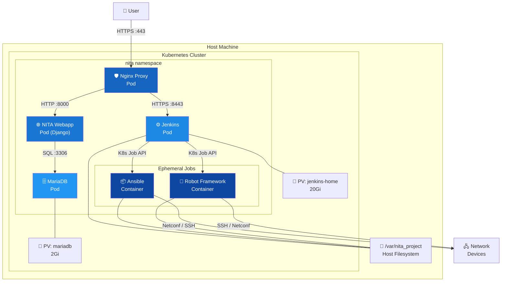
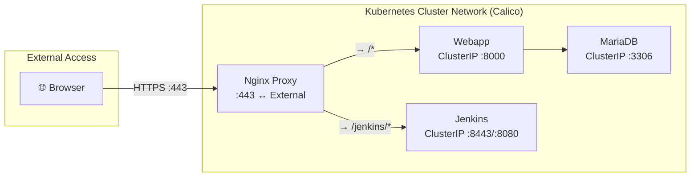
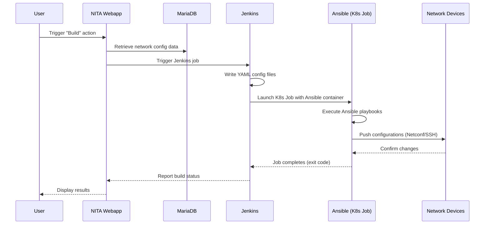
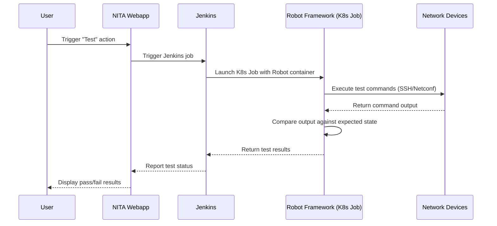
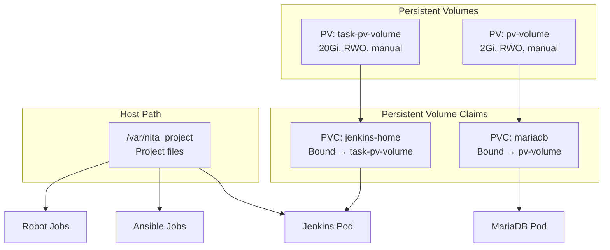
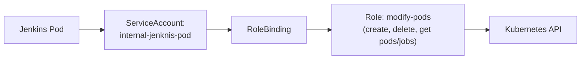
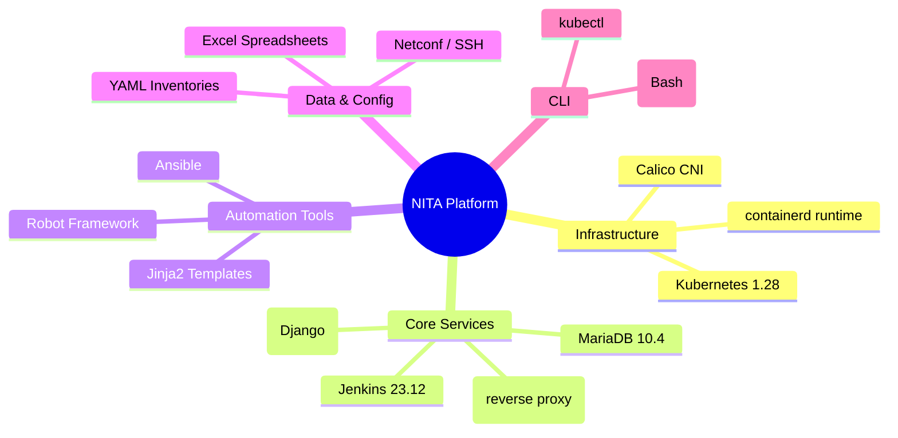

# :material-sitemap: System Architecture

This page provides a comprehensive view of how NITA is designed, how its components interact, and how data flows through the platform during build and test operations.

---

## High-Level Architecture

NITA runs as a set of Kubernetes pods within the `nita` namespace. Four pods run persistently, while Ansible and Robot containers are launched on-demand by Jenkins as ephemeral Kubernetes jobs.

---

## Component Overview

| Component | Image | Type | Port(s) | Purpose |
|---|---|---|---|---|
| **Nginx Proxy** | `nginx:stable` | Persistent | 443 (HTTPS) | TLS termination, reverse proxy |
| **NITA Webapp** | `juniper/nita-webapp:25.10-1` | Persistent | 8000 | Web UI, REST API, project management |
| **Jenkins** | `juniper/nita-jenkins:23.12-1` | Persistent | 8443, 8080 | Job orchestration, pipeline execution |
| **MariaDB** | `mariadb:10.4.12` | Persistent | 3306 | Relational database (Django backend) |
| **Ansible** | `juniper/nita-ansible:22.8-1` | Ephemeral | — | Configuration management |
| **Robot** | `juniper/nita-robot:22.8-1` | Ephemeral | — | Automated testing |

---

## Network Topology

All pods communicate within the Kubernetes cluster network managed by **Calico**. Only the Nginx proxy is exposed externally.

!!! note "Service Types"
    All internal services use **ClusterIP** — they are only accessible within the cluster. The Nginx proxy pod uses **hostPort 443** to expose NITA to the host network.

---

## Data Flow: Build Process

When a user triggers a **Build** action from the Webapp, the following sequence occurs:

---

## Data Flow: Test Process

When a user triggers a **Test** action, Robot Framework validates the network state:

---

## Storage Architecture

NITA uses a combination of Kubernetes Persistent Volumes and host filesystem mounts:

| Storage | Size | Access | Used By | Purpose |
|---|---|---|---|---|
| `jenkins-home` PVC | 20 Gi | ReadWriteOnce | Jenkins | Jenkins home directory, job configs, plugins |
| `mariadb` PVC | 2 Gi | ReadWriteOnce | MariaDB | Database files |
| `/var/nita_project` | Host | ReadWrite | Jenkins, Ansible, Robot | Shared project files |

---

## ConfigMaps

NITA uses Kubernetes ConfigMaps to inject certificates and proxy configuration:

| ConfigMap | Contents | Used By |
|---|---|---|
| `jenkins-crt` | Jenkins SSL certificate | Jenkins pod |
| `jenkins-keystore` | Jenkins keystore (JKS) | Jenkins pod |
| `proxy-config-cm` | Nginx configuration | Proxy pod |
| `proxy-cert-cm` | Nginx TLS certificates | Proxy pod |

---

## RBAC & Security

Jenkins requires Kubernetes API access to launch ephemeral Ansible and Robot jobs:

| Resource | Name | Purpose |
|---|---|---|
| ServiceAccount | `internal-jenknis-pod` | Identity for Jenkins pod |
| Role | `modify-pods` | Permissions to manage pods and jobs |
| RoleBinding | — | Binds ServiceAccount to Role |

---

## Technology Stack Summary

