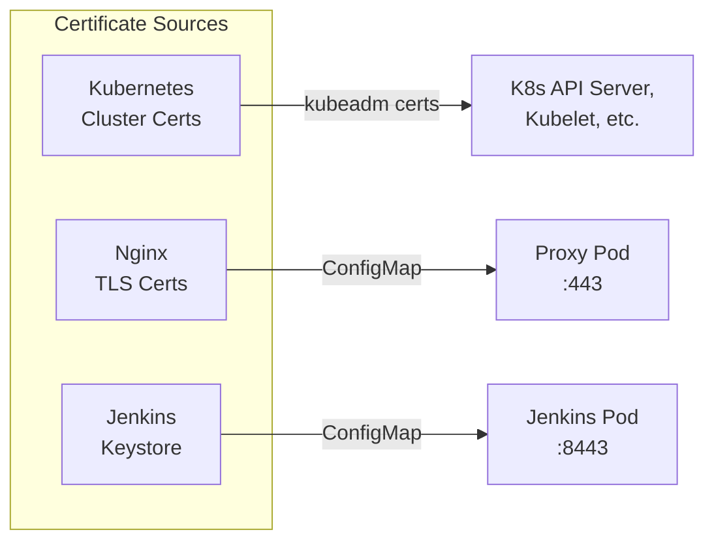

# :material-shield-lock: Certificate Management

NITA uses TLS certificates for secure communication between components and with external users. This page covers certificate generation, renewal, and troubleshooting.

---

## Certificate Overview



| Certificate | Generated By | Validity | Used By |
|---|---|---|---|
| Kubernetes cluster | `kubeadm init` | 1 year | API server, kubelet |
| Nginx TLS | `openssl` (self-signed) | 1 year | Nginx proxy pod |
| Jenkins keystore | `keytool` (self-signed) | — | Jenkins HTTPS |

---

## Kubernetes Certificates

### Check Expiration

```bash
sudo kubeadm certs check-expiration
```

### Renew Certificates

```bash
sudo kubeadm certs renew all
sudo systemctl restart kubelet
```

!!! warning "One-Year Expiry"
    Kubernetes certificate duration is hardcoded to 1 year in `kubeadm`. Set a calendar reminder to renew annually.

---

## Nginx TLS Certificates

### Generate New Certificates

```bash
openssl req -x509 -nodes -days 365 -newkey rsa:2048 \
  -keyout /opt/nita/k8s/proxy/certificates/nginx-certificate-key.key \
  -out /opt/nita/k8s/proxy/certificates/nginx-certificate.crt
```

### Update ConfigMap

```bash
kubectl delete cm proxy-cert-cm -n nita
kubectl create cm proxy-cert-cm \
  --from-file=/opt/nita/k8s/proxy/certificates/ \
  --namespace nita
nita-cmd proxy restart
```

---

## Jenkins Keystore

### Generate New Keystore

```bash
# Generate JKS keystore
keytool -genkey -keyalg RSA -alias selfsigned \
  -keystore jenkins_keystore.jks \
  -keypass nita123 -storepass nita123 -keysize 4096 \
  -dname "cn=jenkins, ou=, o=, l=, st=, c="

# Convert to PKCS12
keytool -importkeystore \
  -srckeystore jenkins_keystore.jks \
  -destkeystore jenkins.p12 \
  -deststoretype PKCS12 \
  -deststorepass nita123 -srcstorepass nita123

# Extract certificate
openssl pkcs12 -in jenkins.p12 -nokeys -out jenkins.crt \
  -password pass:nita123
```

### Update ConfigMaps

```bash
kubectl delete cm jenkins-crt -n nita
kubectl delete cm jenkins-keystore -n nita

kubectl create configmap jenkins-crt \
  --from-file=jenkins.crt --namespace nita
kubectl create cm jenkins-keystore \
  --from-file=jenkins_keystore.jks --namespace nita

# Restart Jenkins
kubectl rollout restart deployment/jenkins -n nita
```

---

## Zscaler / Zero-Trust Environments

If your environment uses a zero-trust security solution (like Zscaler), container image downloads may fail with:

```
[ERROR ImagePull]: failed to pull image....
tls: failed to verify certificate: x509: certificate signed by unknown authority
```

### Step 1: Get the Certificates

Identify the failing URL from the error, then download the certificate chain:

```bash
openssl s_client -connect europe-west2-docker.pkg.dev:443 -showcerts > Zscaler.pem
```

Press `Ctrl+C` to return to the shell. Verify the certificates work:

```bash
wget --ca-certificate=Zscaler.pem <failing-url>
```

### Step 2: Install the Certificates

Split the PEM file into individual certificate files (one per certificate), then install:

=== "Ubuntu"

    ```bash
    sudo cp -v Zscaler*.pem /usr/local/share/ca-certificates/
    sudo cp -v Zscaler*.pem /usr/lib/ssl/certs/
    sudo chmod 644 /usr/local/share/ca-certificates/Zscaler*.pem
    sudo update-ca-certificates --fresh
    ```

=== "AlmaLinux"

    ```bash
    sudo cp -v Zscaler*.pem /etc/pki/ca-trust/source/anchors/
    sudo chmod 644 /etc/pki/ca-trust/source/anchors/Zscaler*.pem
    sudo update-ca-trust
    ```

!!! tip "Reboot Recommended"
    A reboot is recommended after installing new certificates before resuming NITA installation.

### Recovery After Failed Install

If `kubeadm init` failed due to certificate issues:

```bash
sudo kubeadm reset
sudo systemctl restart containerd.service
```

Then resume installation at the "Initialise Kubernetes cluster" step.
