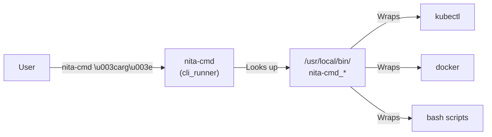

# :material-console: CLI Reference — `nita-cmd`

`nita-cmd` is NITA's bash-based command line interface for controlling all platform components. It provides simple, memorable shortcuts for common Kubernetes and Docker operations.

---

## Getting Started

### Interactive Mode

Launch `nita-cmd` without arguments to enter interactive mode:

```bash
$ nita-cmd
nita-cmd> help
    nita-cmd ansible cli 22.8 => Starts an ansible container...
    nita-cmd cli version => Shows NITA CLI current version.
    ...
nita-cmd> exit
$
```

### Command Mode

Execute commands directly from your shell:

```bash
nita-cmd <command> [subcommand] [arguments]
```

### Version

```bash
$ nita-cmd cli version
nita-cli 22.8
```

---

## Command Reference

### Kubernetes Cluster

| Command | Description |
|---|---|
| `nita-cmd kube pods` | List all running NITA pods |
| `nita-cmd kube nodes` | List all nodes in the Kubernetes cluster |
| `nita-cmd kube cluster` | Show cluster information |
| `nita-cmd kube cluster detail` | Show detailed cluster information |
| `nita-cmd kube version` | Show Kubernetes version |
| `nita-cmd kube cm` | List all ConfigMaps |
| `nita-cmd kube cm detail` | Show ConfigMap details |
| `nita-cmd kube ns` | Show NITA namespace |
| `nita-cmd kube ns all` | List all namespaces |

---

### Containers & Pods

| Command | Description |
|---|---|
| `nita-cmd containers ls` | List all running NITA containers |
| `nita-cmd containers versions` | Show version numbers of running containers |
| `nita-cmd ips` | Show IP addresses assigned to containers |
| `nita-cmd stats` | Show runtime statistics (CPU, memory, I/O) |
| `nita-cmd images ls` | List all NITA images |

---

### Jenkins

| Command | Description |
|---|---|
| `nita-cmd jenkins up` | Create and start the Jenkins container |
| `nita-cmd jenkins down` | Stop and remove the Jenkins container |
| `nita-cmd jenkins start` | Start the Jenkins container |
| `nita-cmd jenkins stop` | Stop the Jenkins container |
| `nita-cmd jenkins restart` | Restart the Jenkins container |
| `nita-cmd jenkins status` | Check Jenkins container status |
| `nita-cmd jenkins ips` | Show Jenkins IP address |
| `nita-cmd jenkins ports` | Show Jenkins mapped ports |
| `nita-cmd jenkins cli jenkins` | Log into Jenkins shell as `jenkins` user |
| `nita-cmd jenkins cli root` | Log into Jenkins shell as `root` |
| `nita-cmd jenkins volumes` | Show shared volumes |
| `nita-cmd jenkins jobs ls` | List all Jenkins jobs |

---

### Ansible (Ephemeral)

| Command | Description |
|---|---|
| `nita-cmd ansible cli 22.8` | Start Ansible container and log into shell |

!!! note
    The version number (`22.8`) refers to the Ansible container image tag. When you `exit` the shell, the container stops.

---

### Robot Framework (Ephemeral)

| Command | Description |
|---|---|
| `nita-cmd robot cli 22.8` | Start Robot container and log into shell |

---

### Webapp

| Command | Description |
|---|---|
| `nita-cmd webapp cli` | Log into the Webapp container shell |

---

### Proxy

| Command | Description |
|---|---|
| `nita-cmd proxy restart` | Restart the Nginx proxy |
| `nita-cmd db restart` | Restart the MariaDB database |

---

### Utility

| Command | Description |
|---|---|
| `nita-cmd help` | Show all available commands |
| `nita-cmd license` | Show license information |
| `nita-cmd cli version` | Show CLI version |

---

## Bash Auto-Completion

NITA supports bash auto-completion. Add this to your `~/.bashrc`:

```bash
if [ -f /usr/share/bash-completion/bash_completion ]; then
    . /usr/share/bash-completion/bash_completion
fi
```

Then source it:

```bash
source ~/.bashrc
```

Now you can use Tab completion:

```bash
$ nita-cmd j<tab>
nita-cmd jenkins

$ nita-cmd jenkins <tab>
backup   down     jobs     logs     ports    restore  start    stop     version  whoami
cli      ips      labels   plugins  restart  set      status   up       volumes
```

---

## Creating Custom Commands

`nita-cmd` is extensible — add your own commands by creating scripts in `/usr/local/bin/`.

### Naming Convention

- Command script: `nita-cmd_<name>`
- Help script: `nita-cmd_<name>_help`
- Sub-commands: Use underscores for hierarchy (e.g., `nita-cmd_mycommand_subcommand`)

### Example: Hello World

```bash
# Create the command script
sudo tee /usr/local/bin/nita-cmd_hello << 'EOF'
#!/bin/bash
if [ "$_CLI_RUNNER_DEBUG" == 1 ]; then
    echo 'echo "Hello World!"' >&2
fi
echo "Hello World!" >&1
EOF

sudo chmod +x /usr/local/bin/nita-cmd_hello

# Create the help script
sudo tee /usr/local/bin/nita-cmd_hello_help << 'EOF'
#!/bin/bash
echo -n "    nita-cmd hello => "
echo "Outputs the classic Hello World statement" >&1
EOF

sudo chmod +x /usr/local/bin/nita-cmd_hello_help
```

Test it:

```bash
$ nita-cmd hello
Hello World!

$ nita-cmd hello help
Outputs the classic Hello World statement
```

### Debugging

Enable debug output with the `_CLI_RUNNER_DEBUG` environment variable:

```bash
export _CLI_RUNNER_DEBUG=1
nita-cmd hello
```

---

## Architecture



`nita-cmd` is essentially a lightweight wrapper that:

1. Provides an interactive REPL
2. Maps user-friendly command names to executable scripts
3. Supports auto-completion and help for every command
4. Can be extended with custom scripts
