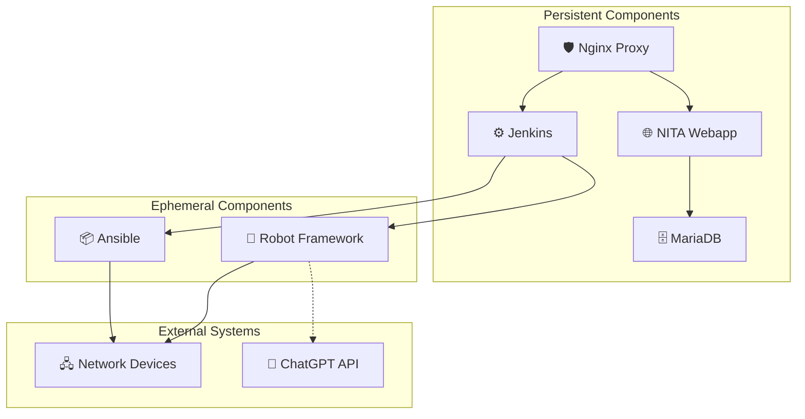
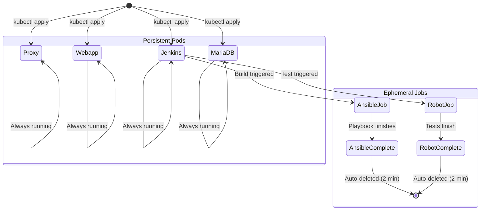

# :material-puzzle: Component Breakdown

NITA is composed of six core components, each running as a container within Kubernetes. This page details the purpose, configuration, and operational characteristics of each component.

---

## Component Map



---

## 🛡️ Nginx Proxy

The Nginx reverse proxy acts as the front door to NITA, handling TLS termination and routing requests to the appropriate backend service.

| Property | Value |
|---|---|
| **Image** | `nginx:stable` |
| **Type** | Persistent pod |
| **External Port** | 443 (HTTPS) |
| **K8s Service** | — (hostPort) |
| **ConfigMaps** | `proxy-config-cm`, `proxy-cert-cm` |

**Routing Rules:**

- `https://<host>:443/` → NITA Webapp (:8000)
- `https://<host>:8443/` → Jenkins (:8443)

**Key Files:**

- `/etc/nginx/nginx.conf` — Nginx configuration (from ConfigMap)
- `/etc/certificate/` — TLS certificates (from ConfigMap)

!!! tip "Restart Proxy"
    ```bash
    nita-cmd proxy restart
    ```

---

## 🌐 NITA Webapp

The Webapp provides the primary user interface for NITA. It is a **Django-based** web application that manages network types, networks, configuration data, and triggers build/test actions.

| Property | Value |
|---|---|
| **Image** | `juniper/nita-webapp:25.10-1` |
| **Type** | Persistent pod |
| **Internal Port** | 8000 |
| **Framework** | Django (Python) |
| **Database** | MariaDB (Sites) |

**Key Features:**

- Upload and manage **Network Types** (project templates)
- Define **Networks** with host inventories
- Import **configuration data** via Excel spreadsheets
- Trigger **Build**, **Test**, and **NOOB** actions
- View **console output** and job history
- Export/import YAML data

**Default Credentials:**

| Username | Password |
|---|---|
| `vagrant` | `vagrant123` |

**Database Tables (Sites):**

| Table | Purpose |
|---|---|
| `ngcn_campustype` | Network types |
| `ngcn_campusnetwork` | Network instances |
| `ngcn_action` | Available actions (Build, Test, etc.) |
| `ngcn_actionhistory` | Action execution history |
| `ngcn_workbook` | Uploaded Excel workbooks |
| `ngcn_worksheets` | Individual worksheet data |
| `ngcn_resource` | Network resources |
| `ngcn_role` | Ansible roles |

!!! tip "Access Webapp Shell"
    ```bash
    nita-cmd webapp cli
    ```

---

## ⚙️ Jenkins

Jenkins is the automation engine at the heart of NITA. It orchestrates all build and test workflows by managing pipelines that launch ephemeral Ansible and Robot containers as Kubernetes jobs.

| Property | Value |
|---|---|
| **Image** | `juniper/nita-jenkins:23.12-1` |
| **Type** | Persistent pod |
| **HTTPS Port** | 8443 |
| **HTTP Port** | 8080 |
| **Storage** | `jenkins-home` PVC (20 Gi) |
| **ServiceAccount** | `internal-jenknis-pod` |

**Built-in Jobs:**

| Job | Purpose |
|---|---|
| `network_template_mgr` | Handles new project uploads and network type creation |
| `network_type_validator` | Validates network definitions and triggers builds/tests |

!!! warning "Protected Jobs"
    Do not delete or modify `network_template_mgr` or `network_type_validator` — these are core NITA workflows.

**Key Environment Variable:**

```
JENKINS_OPTS=--httpPort=8080 --httpsPort=8443
  --httpsKeyStore=/var/jenkins_home/certificate/jenkins_keystore.jks
  --httpsKeyStorePassword=nita123
```

**Useful Commands:**

```bash
nita-cmd jenkins status        # Check Jenkins status
nita-cmd jenkins cli jenkins   # Log in as jenkins user
nita-cmd jenkins cli root      # Log in as root
nita-cmd jenkins jobs ls       # List all Jenkins jobs
nita-cmd jenkins restart       # Restart Jenkins
```

---

## 🗄️ MariaDB

MariaDB provides persistent relational storage for the NITA Webapp's Django backend.

| Property | Value |
|---|---|
| **Image** | `mariadb:10.4.12` |
| **Type** | Persistent pod |
| **Internal Port** | 3306 |
| **Database** | `Sites` |
| **Credentials** | `root` / `root` |
| **Storage** | `mariadb` PVC (2 Gi) |

**Accessing the Database:**

=== "via kubectl"

    ```bash
    kubectl exec -it -n nita <db-pod-name> -- bash
    mysql -u root -p
    ```

=== "via SQL"

    ```sql
    USE Sites;
    SHOW TABLES;
    SELECT * FROM ngcn_campusnetwork;
    ```

!!! note "Read-Only Recommended"
    Direct database modifications are not recommended. Use the NITA Webapp UI or API for data management.

---

## 📦 Ansible (Ephemeral)

The Ansible container is launched on-demand by Jenkins as a Kubernetes job to execute Ansible playbooks for device configuration.

| Property | Value |
|---|---|
| **Image** | `juniper/nita-ansible:22.8-1` |
| **Type** | Ephemeral (K8s Job) |
| **Lifespan** | Created for each build, auto-deleted after 2 minutes |
| **Volumes** | `/project` (host), `/var/tmp/build` (host) |

**Behaviour:**

- Started by Jenkins via `kubectl apply` with a generated job YAML
- Executes Ansible playbooks defined in `build.sh`
- Communicates with network devices via **Netconf** or **SSH**
- All data is temporary — reset on each execution
- Only one instance can run at a time

**Manual Access:**

```bash
nita-cmd ansible cli 22.8
```

---

## 🧪 Robot Framework (Ephemeral)

The Robot container is launched on-demand by Jenkins to execute automated network tests using Robot Framework.

| Property | Value |
|---|---|
| **Image** | `juniper/nita-robot:22.8-1` |
| **Type** | Ephemeral (K8s Job) |
| **Lifespan** | Created for each test, auto-deleted after 2 minutes |
| **Volumes** | `/project` (host), `/var/tmp/build` (host) |

**Behaviour:**

- Started by Jenkins via `kubectl apply` with a generated job YAML
- Executes Robot test suites defined in `test.sh`
- Tests communicate with devices via **SSH** / **Netconf**
- Generates HTML test reports (viewable in Jenkins)
- Can integrate with external APIs (e.g., ChatGPT for failure analysis)
- Only one instance can run at a time

**Manual Access:**

```bash
nita-cmd robot cli 22.8
```

---

## Component Lifecycle



---

## NITA Sub-Repositories

NITA is organized across multiple GitHub repositories, each containing the source for a specific component:

| Repository | Purpose |
|---|---|
| [nita](https://github.com/Juniper/nita) | Meta repository, install scripts, examples, K8s configs |
| [nita-webapp](https://github.com/Juniper/nita-webapp) | Webapp container (Django), nita-cmd CLI |
| [nita-jenkins](https://github.com/Juniper/nita-jenkins) | Jenkins container, Dockerfile, plugins |
| [nita-ansible](https://github.com/Juniper/nita-ansible) | Ansible container, included libraries |
| [nita-robot](https://github.com/Juniper/nita-robot) | Robot Framework container, test libraries |
| [nita-yaml-to-excel](https://github.com/Juniper/nita-yaml-to-excel) | YAML ↔ Excel conversion tools |
