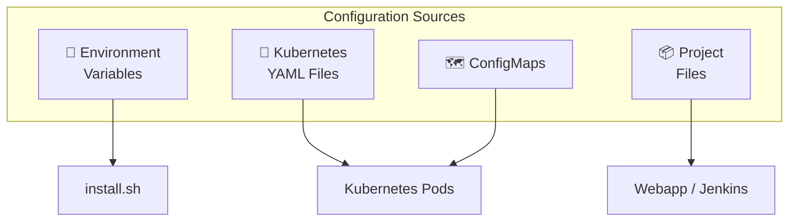

# :material-cog: Configuration

This guide covers how to configure NITA's components, customize deployments, and tune settings to match your environment.

---

## Configuration Overview



---

## Kubernetes Configuration

### Namespace

All NITA resources run in a dedicated `nita` namespace:

```yaml
# k8s/nita-namespace.yaml
apiVersion: v1
kind: Namespace
metadata:
  name: nita
```

### Pod Deployments

Deployment YAML files are located at `$K8SROOT` (default: `/opt/nita/k8s/`):

| File | Component |
|---|---|
| `jenkins-deployment.yaml` | Jenkins pod |
| `webapp-deployment.yaml` | Webapp pod |
| `db-deployment.yaml` | MariaDB pod |
| `proxy-deployment.yaml` | Nginx proxy pod |

**Changing a container image version:**

Edit the appropriate deployment YAML and update the `image:` field:

```yaml
# Before
image: juniper/nita-jenkins:23.12-1

# After
image: juniper/nita-jenkins:25.01-1
```

Then apply:

```bash
kubectl delete deployment jenkins -n nita
kubectl apply -f /opt/nita/k8s/jenkins-deployment.yaml
sudo systemctl restart kubelet
```

---

### Persistent Volumes

| File | Volume | Size | Purpose |
|---|---|---|---|
| `pv.yaml` | `pv-volume` | 2 Gi | MariaDB data |
| `pv2.yaml` | `task-pv-volume` | 20 Gi | Jenkins home |

**Adjusting volume sizes:**

Edit the PV YAML and PVC YAML with matching capacity values, then re-apply:

```bash
kubectl apply -f pv2.yaml
kubectl apply -f jenkins-home-persistentvolumeclaim.yaml
```

---

### Services

| File | Service | Type | Ports |
|---|---|---|---|
| `db-service.yaml` | `db` | ClusterIP | 3306 |
| `jenkins-service.yaml` | `jenkins` | ClusterIP | 8443, 8080 |
| `webapp-service.yaml` | `webapp` | ClusterIP | 8000 |

---

## Nginx Proxy Configuration

The Nginx configuration is managed via a Kubernetes ConfigMap:

```bash
# View current config
kubectl get cm proxy-config-cm -n nita -o yaml

# Update the config
kubectl create cm proxy-config-cm \
  --from-file=/opt/nita/k8s/proxy/nginx.conf \
  --namespace nita --dry-run=client -o yaml | kubectl apply -f -

# Restart proxy to pick up changes
nita-cmd proxy restart
```

**TLS Certificates:**

```bash
# Generate new self-signed certificates
openssl req -x509 -nodes -days 365 -newkey rsa:2048 \
  -keyout /opt/nita/k8s/proxy/certificates/nginx-certificate-key.key \
  -out /opt/nita/k8s/proxy/certificates/nginx-certificate.crt

# Update the ConfigMap
kubectl create cm proxy-cert-cm \
  --from-file=/opt/nita/k8s/proxy/certificates/ \
  --namespace nita --dry-run=client -o yaml | kubectl apply -f -
```

---

## Jenkins Configuration

### Jenkins OPTS

The Jenkins container is configured via the `JENKINS_OPTS` environment variable in `jenkins-deployment.yaml`:

```
--httpPort=8080
--httpsPort=8443
--httpsKeyStore=/var/jenkins_home/certificate/jenkins_keystore.jks
--httpsKeyStorePassword=nita123
```

### Jenkins Keystore

To regenerate the Jenkins keystore:

```bash
# Generate keystore
keytool -genkey -keyalg RSA -alias selfsigned \
  -keystore jenkins_keystore.jks \
  -keypass nita123 -storepass nita123 -keysize 4096 \
  -dname "cn=jenkins, ou=, o=, l=, st=, c="

# Convert to PKCS12
keytool -importkeystore \
  -srckeystore jenkins_keystore.jks \
  -destkeystore jenkins.p12 \
  -deststoretype PKCS12

# Extract certificate
openssl pkcs12 -in jenkins.p12 -nokeys -out jenkins.crt

# Update ConfigMaps
kubectl create configmap jenkins-crt \
  --from-file=jenkins.crt --namespace nita
kubectl create cm jenkins-keystore \
  --from-file=jenkins_keystore.jks --namespace nita
```

---

## MariaDB Configuration

The MariaDB pod uses environment variables in `db-deployment.yaml`:

| Variable | Default | Description |
|---|---|---|
| `MYSQL_DATABASE` | `Sites` | Database name |
| `MYSQL_ROOT_PASSWORD` | `root` | Root password |

!!! warning "Security"
    In production environments, change the default MariaDB root password and Jenkins keystore passwords.

---

## Webapp Configuration

The Webapp pod uses the `DJANGO_LOG_LEVEL` environment variable:

```yaml
env:
  - name: DJANGO_LOG_LEVEL
    value: DEBUG
```

Available log levels: `DEBUG`, `INFO`, `WARNING`, `ERROR`, `CRITICAL`

---

## Project Configuration

### project.yaml

Every NITA project contains a `project.yaml` file that defines the available actions:

```yaml
name: My Network Project
description: Automates a custom network topology

actions:
  - name: Build
    jenkins_url: my_project_build
    category: BUILD
    configuration:
      - shell_command: ./build.sh

  - name: Test
    jenkins_url: my_project_test
    category: TEST
    configuration:
      - shell_command: ./test.sh
```

**Action Categories:**

| Category | Purpose | Container |
|---|---|---|
| `NOOB` | New Out Of the Box — initial device setup | Ansible |
| `BUILD` | Configuration deployment | Ansible |
| `TEST` | Automated testing | Robot Framework |

### ansible.cfg

Standard Ansible configuration is provided via `ansible.cfg` in each project:

```ini
[defaults]
host_key_checking = False
timeout = 30
```

### Inventory (hosts)

Device inventories use Ansible INI format:

```ini
[all:children]
dc1
dc2

[dc1]
dc1-spine1
dc1-spine2

[dc2]
dc2-spine1
dc2-spine2
```

---

## File System Layout

```
/opt/
├── nita/              # Meta repository
│   ├── k8s/           # Kubernetes YAML manifests
│   │   ├── proxy/     # Nginx config & certificates
│   │   └── ...
│   ├── examples/      # Example projects
│   └── cli_scripts/   # CLI script sources
├── nita-webapp/       # Webapp container source
├── nita-jenkins/      # Jenkins container source
├── nita-ansible/      # Ansible container source
├── nita-robot/        # Robot container source
└── nita-yaml-to-excel/  # YAML ↔ Excel tools

/var/
├── nita_project/      # Shared project files (host mount)
└── jenkins_home/      # Jenkins home (PVC mount)

/usr/local/bin/
├── nita-cmd           # Main CLI command
└── nita-cmd_*         # CLI sub-command scripts
```
