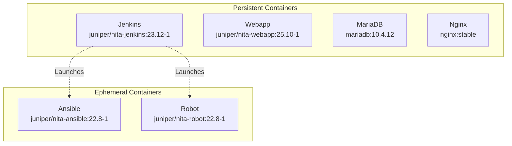
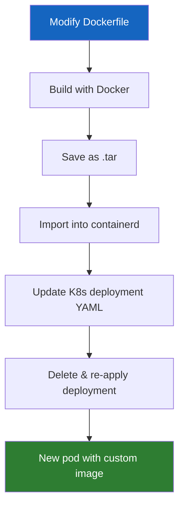

# :material-docker: Container Management

NITA uses containers for all of its application components. This page covers how to manage, inspect, and customize containers.

---

## Container Types



| Type | Behaviour | Examples |
|---|---|---|
| **Persistent** | Run continuously within K8s pods | Jenkins, Webapp, MariaDB, Nginx |
| **Ephemeral** | Started on-demand, auto-deleted after 2 minutes | Ansible, Robot |

!!! note "containerd Runtime"
    NITA uses the `containerd` runtime (not Docker). Docker is only needed for building custom container images.

---

## Inspecting Containers

### With `nita-cmd`

```bash
# List running NITA containers
nita-cmd containers ls

# Show container versions
nita-cmd containers versions

# Show container IP addresses
nita-cmd ips

# Show container resource usage
nita-cmd stats
```

### With `kubectl`

```bash
# List pods (containers)
kubectl get pods -n nita

# Describe a specific pod
kubectl describe pod <pod-name> -n nita

# View container logs
kubectl logs <pod-name> -n nita
```

---

## Accessing Container Shells

### NITA Containers

```bash
# Jenkins (as jenkins user)
nita-cmd jenkins cli jenkins

# Jenkins (as root)
nita-cmd jenkins cli root

# Webapp
nita-cmd webapp cli

# Ansible (starts ephemeral container)
nita-cmd ansible cli 22.8

# Robot (starts ephemeral container)
nita-cmd robot cli 22.8
```

### Standard Containers (MariaDB, Nginx)

Standard containers are not tagged as NITA, so use `kubectl`:

```bash
# Find the pod name
kubectl get pods -n nita

# Access the shell
kubectl exec -it -n nita <pod-name> -- bash
```

---

## Ephemeral Container Behaviour

- **Launched by Jenkins** as Kubernetes jobs
- **Mount shared volumes:** `/project` and `/var/tmp/build`
- **Only one instance** can run at a time
- **Data is temporary** — reset on each execution
- **Auto-deleted** 2 minutes after completion

!!! warning "Concurrent Instances"
    Only one Ansible or Robot container can run at a time. If you manually launch one, Jenkins may fail if it tries to start another.

---

## Creating Custom Containers

You can customize any NITA container by modifying its Dockerfile and rebuilding.

### Prerequisites

Install Docker Community Edition:

=== "AlmaLinux"

    ```bash
    sudo dnf install -y docker-ce
    sudo usermod -aG docker <username>
    sudo service docker restart
    ```

=== "Ubuntu"

    ```bash
    sudo apt install -y docker-ce
    sudo usermod -aG docker <username>
    sudo service docker restart
    ```

### Example: Custom Jenkins Container

**1. Replace the Dockerfile:**

```bash
cd /opt/nita-jenkins
sudo mv Dockerfile Dockerfile-
sudo wget https://github.com/Juniper/nita/raw/refs/heads/main/examples/chatgpt/robot.jar
sudo wget https://raw.githubusercontent.com/Juniper/nita/refs/heads/main/examples/chatgpt/Dockerfile
```

**2. Update the build tag** in `build_container.sh`:

```bash
docker build --build-arg KUBECTL_ARCH=${KUBECTL_ARCH} -t juniper/nita-jenkins:25.01-1 .
```

!!! warning "Don't forget the dot at the end of the line!"

**3. Build the image:**

```bash
sudo ./build_container.sh
```

**4. Verify the image:**

```bash
docker image ls
# REPOSITORY             TAG       IMAGE ID       CREATED         SIZE
# juniper/nita-jenkins   25.01-1   79300ab8d042   8 minutes ago   1.69GB
```

**5. Import into containerd:**

```bash
docker save juniper/nita-jenkins:25.01-1 > nita-jenkins:25.01-1.tar
sudo ctr -n=k8s.io image import nita-jenkins:25.01-1.tar
```

**6. Update the Kubernetes deployment:**

Edit `/opt/nita/k8s/jenkins-deployment.yaml`:

```yaml
# Change:
image: juniper/nita-jenkins:23.12-1
# To:
image: juniper/nita-jenkins:25.01-1
```

!!! note "YAML Formatting"
    Use spaces, not tabs, in Kubernetes YAML files.

**7. Restart the pod:**

```bash
sudo kubectl delete deployment jenkins -n nita
sudo kubectl apply -f /opt/nita/k8s/jenkins-deployment.yaml
sudo systemctl restart kubelet
```

**If Kubernetes uses the cached image:**

```bash
sudo kubectl rollout restart deployment/jenkins -n nita
```

---

## Custom Container Workflow


