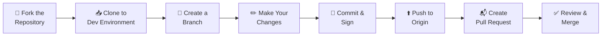

# :material-handshake: Contributing to NITA

We welcome contributions from the community! Whether you're fixing a bug, adding a feature, or improving documentation, your contributions help make NITA better for everyone.

---

## Why Contribute?

NITA is a community-driven project. By contributing, you:

- **Save time** for future users by solving problems once
- **Improve quality** by adding tests and fixing bugs
- **Expand features** with your unique use cases
- **Build reputation** in the network automation community

---

## Contribution Workflow



---

## Step-by-Step Guide

### 1. Create a GitHub Account

If you don't already have one, create an account at [github.com](https://github.com).

### 2. Verify Your Email Address

Follow [GitHub's instructions](https://docs.github.com/en/get-started/signing-up-for-github/verifying-your-email-address) to verify your email. If you're a Juniper employee, verify your corporate email as well.

### 3. Generate GPG Keys

Generate a public/private keypair for signing commits:

```bash
# Install dependencies (if needed)
sudo apt install gnupg rng-tools

# Generate key
gpg --full-generate-key
```

Follow [GitHub's GPG key guide](https://docs.github.com/en/authentication/managing-commit-signature-verification/generating-a-new-gpg-key) for detailed instructions.

### 4. Configure Your Git Profile

Add your GPG key to your GitHub account settings, then configure locally:

```bash
# Set your signing key
git config --global user.signingkey <your-key-id>
git config --global commit.gpgsign true

# Set GPG binary path
git config --global gpg.program gpg
```

### 5. Fork the Repository

1. Navigate to the NITA repository you want to contribute to
2. Click **Fork** and create a copy in your account
3. Only copy the `main` branch (default)

### 6. Clone and Create a Branch

```bash
# Clone your fork
git clone https://github.com/<your-username>/nita.git
cd nita

# Create a development branch
git checkout -b development
```

### 7. Make Your Changes

- Edit files, add new features, or fix bugs
- Run `git add` for any new files
- Keep changes focused and related

### 8. Commit Your Changes

```bash
# Stage changes
git add .

# Commit with a signed commit
git commit -S -m "Add feature: description of your change"
```

!!! tip "Commit Best Practices"
    - Group related changes into a single commit
    - Write clear, descriptive commit messages
    - Sign all commits (`-S` flag or `commit.gpgsign=true`)

### 9. Push to Origin

```bash
git push origin development
```

### 10. Create a Pull Request

1. Go to the upstream repository on GitHub
2. Click **New Pull Request**
3. Select your fork and branch
4. Provide a clear description of your changes
5. Submit the PR

---

## NITA Repositories

| Repository | Description |
|---|---|
| [nita](https://github.com/Juniper/nita) | Meta repository, examples, K8s configs |
| [nita-webapp](https://github.com/Juniper/nita-webapp) | Django webapp, nita-cmd CLI |
| [nita-jenkins](https://github.com/Juniper/nita-jenkins) | Jenkins container |
| [nita-ansible](https://github.com/Juniper/nita-ansible) | Ansible container |
| [nita-robot](https://github.com/Juniper/nita-robot) | Robot Framework container |
| [nita-yaml-to-excel](https://github.com/Juniper/nita-yaml-to-excel) | YAML ↔ Excel tools |

---

## Code of Conduct

- Be respectful and constructive
- Keep discussions focused on technical topics
- Unsigned commits may take longer to review or be rejected

---

## License

NITA is released under the **MIT License**. By contributing, you agree that your contributions will be licensed under the same terms.

---

## Need Help?

- :material-github: [Open an Issue](https://github.com/Juniper/nita/issues)
- :material-star: If you enjoy NITA, give the repo a ⭐ on GitHub!
