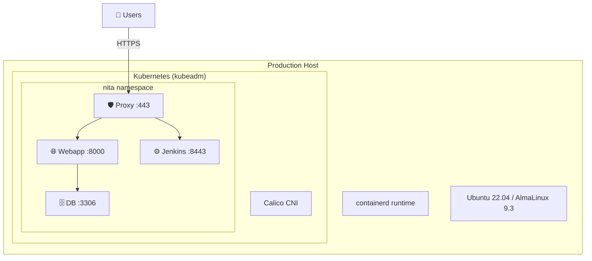

# :material-rocket-launch: Deployment Guide

This guide covers deploying NITA in production, managing pod lifecycles, upgrading components, and operational best practices.

---

## Deployment Model

NITA deploys as a **single-node Kubernetes cluster** with all components running within the `nita` namespace.



---

## Deployment Procedure

### Fresh Deployment

Run the automated [Installation](installation.md) script:

```bash
sudo -E ./install.sh
```

After installation, verify all pods are running:

```bash
nita-cmd kube pods
```

### Access Points

| Service | URL |
|---|---|
| NITA Webapp | `https://<host>:443` |
| Jenkins UI | `https://<host>:8443` |

---

## Upgrading Components

### Upgrade a Container Image

1. **Build or pull the new image**
2. **Import into containerd:**

    ```bash
    docker save juniper/nita-jenkins:<new-tag> > nita-jenkins.tar
    sudo ctr -n=k8s.io image import nita-jenkins.tar
    ```

3. **Update the deployment YAML:**

    ```bash
    sudo vi /opt/nita/k8s/jenkins-deployment.yaml
    # Change the image: tag
    ```

4. **Apply the change:**

    ```bash
    kubectl delete deployment jenkins -n nita
    kubectl apply -f /opt/nita/k8s/jenkins-deployment.yaml
    ```

### Upgrade Kubernetes

NITA uses Kubernetes 1.28. To upgrade:

```bash
# Update kubeadm
sudo apt install -y kubeadm=<new-version>

# Plan the upgrade
sudo kubeadm upgrade plan

# Apply the upgrade
sudo kubeadm upgrade apply v<new-version>

# Update kubelet and kubectl
sudo apt install -y kubelet=<new-version> kubectl=<new-version>
sudo systemctl restart kubelet
```

---

## Operational Procedures

### Start / Stop NITA

**Stop all NITA pods:**

```bash
kubectl scale deployment --all --replicas=0 -n nita
```

**Start all NITA pods:**

```bash
kubectl scale deployment --all --replicas=1 -n nita
```

### Restart a Single Component

```bash
kubectl rollout restart deployment/<name> -n nita
```

### Health Checks

```bash
# Pod status
kubectl get pods -n nita

# Pod events / errors
kubectl describe pod <pod-name> -n nita

# Container logs
kubectl logs <pod-name> -n nita

# Resource usage
nita-cmd stats
```

---

## Backup & Restore

### Jenkins Backup

Jenkins data is stored in the `jenkins-home` PVC (20 Gi):

```bash
# Backup Jenkins jobs and configuration
kubectl exec -it -n nita <jenkins-pod> -- tar czf /tmp/jenkins-backup.tar.gz /var/jenkins_home
kubectl cp nita/<jenkins-pod>:/tmp/jenkins-backup.tar.gz ./jenkins-backup.tar.gz
```

**Or use `nita-cmd`:**

```bash
nita-cmd jenkins backup
nita-cmd jenkins restore
```

### MariaDB Backup

```bash
# Dump the database
kubectl exec -it -n nita <db-pod> -- mysqldump -u root -proot Sites > sites-backup.sql

# Restore
kubectl exec -i -n nita <db-pod> -- mysql -u root -proot Sites < sites-backup.sql
```

---

## Security Considerations

| Area | Default | Recommendation |
|---|---|---|
| MariaDB root password | `root` | Change to strong password |
| Jenkins keystore password | `nita123` | Change to strong password |
| Webapp credentials | `vagrant/vagrant123` | Change after first login |
| TLS certificates | Self-signed | Replace with CA-signed certs |
| Kubernetes API | Local access only | Restrict with RBAC policies |

!!! caution "Production Security"
    The default credentials are designed for development and lab environments. Always change passwords and replace self-signed certificates for production deployments.

---

## Monitoring

### Pod Resource Usage

```bash
nita-cmd stats
```

**Example output:**

```
CONTAINER ID   NAME                    CPU %   MEM USAGE / LIMIT   MEM %   NET I/O         BLOCK I/O
34743b207365   nitawebapp_webapp_1     5.85%   88.74MiB / 3.853GiB 2.25%   50.8kB / 25.8kB 44.9MB / 0B
922a4eb21e05   nitajenkins_jenkins_1   0.08%   670.4MiB / 3.853GiB 16.99%  3.09MB / 52.8kB 154MB / 6.94MB
```

### Kubernetes Dashboard (Optional)

You can deploy the Kubernetes dashboard for a web-based view:

```bash
kubectl apply -f https://raw.githubusercontent.com/kubernetes/dashboard/v2.7.0/aio/deploy/recommended.yaml
```

---

## Network Requirements

| Port | Protocol | Direction | Purpose |
|---|---|---|---|
| 443 | TCP | Inbound | NITA Webapp (HTTPS) |
| 8443 | TCP | Inbound | Jenkins UI (HTTPS) |
| 6443 | TCP | Internal | Kubernetes API server |
| 10250 | TCP | Internal | Kubelet |
| 3306 | TCP | Internal | MariaDB |
| 8000 | TCP | Internal | Webapp |
| 8080 | TCP | Internal | Jenkins HTTP |

---

## Architecture Decision: Single-Node

NITA is designed for **single-node Kubernetes deployments**. This simplifies:

- Installation and management
- Persistent volume mounting (hostPath)
- Network complexity (all internal)

For multi-node deployments, you would need:

- Shared storage (NFS, Ceph, etc.)
- Network-aware PVC provisioners
- Load balancer for proxy
