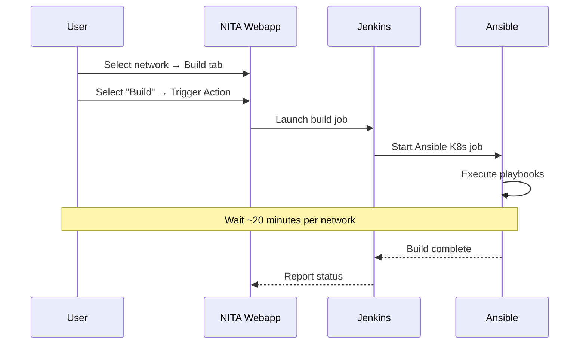

# :material-flask: Example Projects

NITA ships with three example projects that demonstrate its capabilities for automating network builds and tests. These ready-to-use examples are a great way to learn how NITA works.

---

## Available Examples

| Example | Path | Description |
|---|---|---|
| **EVPN VXLAN Data Centre** | `examples/evpn_vxlan_erb_dc` | Build and test an EVPN VXLAN fabric with Juniper QFX devices |
| **eBGP WAN** | `examples/ebgp_wan` | Build and test a DC WAN topology using IPCLOS and eBGP |
| **ChatGPT Integration** | `examples/chatgpt` | AI-powered analysis of failed Robot test cases |

---

## Running the Examples

### Preparation

1. **Clone the NITA repository** (if not already done during installation):

    ```bash
    git clone https://github.com/Juniper/nita.git
    ```

2. **Create zip files** for uploading:

    ```bash
    cd nita
    zip -r evpn_vxlan_erb_dc.zip examples/evpn_vxlan_erb_dc
    zip -r ebgp_wan.zip examples/ebgp_wan
    ```

3. **Verify NITA pods are running:**

    ```bash
    nita-cmd kube pods
    ```

---

### Step 1: Log into NITA Webapp

Navigate to `https://<YOUR-NODE-IP>:443` and log in:

| Username | Password |
|---|---|
| `vagrant` | `vagrant123` |

---

### Step 2: Upload Network Types

1. Navigate to **Network Types** in the left pane
2. Click **Add**
3. Upload the zip file (e.g., `evpn_vxlan_erb_dc.zip`)
4. Repeat for the second zip file (`ebgp_wan.zip`)

---

### Step 3: Create Networks

Navigate to **Networks** and add the following networks:

| Name | Description | Host File | Network Type |
|---|---|---|---|
| `dc1` | Datacenter 1 | `dc1-hosts` | `evpn_vxlan_erb_dc_1.3` |
| `dc2` | Datacenter 2 | `dc2-hosts` | `evpn_vxlan_erb_dc_1.3` |
| `wan` | WAN | `hosts` | `ebgp_wan` |

!!! warning "No Spaces"
    Network names must not contain spaces.

---

### Step 4: Load Configuration Data

For each network, navigate to the **Configuration** tab and import the appropriate Excel file:

| Network | Excel File | Source Directory |
|---|---|---|
| `dc1` | `dc1_data.xlsx` | `examples/evpn_vxlan_erb_dc` |
| `dc2` | `dc2_data.xlsx` | `examples/evpn_vxlan_erb_dc` |
| `wan` | `ebgp_wan.xlsx` | `examples/ebgp_wan` |

---

### Step 5: Run the Build



1. Navigate to **Networks → dc1 → Build** tab
2. Select **Build** from the dropdown
3. Click **Trigger Action**
4. **Wait for completion** (~20 minutes) before building the next network

!!! important "Sequential Builds"
    Build each network sequentially: `dc1` → `dc2` → `wan`. Wait for each build to complete before starting the next.

**Monitor Progress:**

- **NITA Webapp:** Click "Console Log: Auto refresh: Enable"
- **Jenkins UI:** Open `https://<host>:8443`, find the running job, and click "Console Output"

---

### Step 6: Run the Tests

1. Navigate to **Networks → dc1 → Test** tab
2. Select **Test** from the dropdown
3. Click **Trigger Action**
4. Repeat for `dc2` and `wan`

---

### Step 7: Review Test Results

Results can be viewed in:

- **NITA Webapp:** Click "Open *.log html" to see detailed Robot test results
- **Jenkins UI:** Navigate to the completed job to see pass/fail breakdown

**Example results for EVPN VXLAN DC:**

- 30 test cases executed
- Tests cover: firewalls, switches, BGP leaf/spine, IP connectivity
- Results show pass/fail status with detailed command output

---

## EVPN VXLAN Data Centre Example

**Directory:** `examples/evpn_vxlan_erb_dc`

This example demonstrates building a complete EVPN VXLAN data centre fabric:

- **Devices:** QFX switches (spines, leaves, border leaves)
- **Topology:** Dual data centre with ERB (Edge-Routed Bridging)
- **Tests:** 14 Robot tests covering firewalls, BGP, VXLAN, IP connectivity
- **Day-2 Integration:** Netbox inventory and Juniper Paragon Insights

---

## eBGP WAN Example

**Directory:** `examples/ebgp_wan`

This example demonstrates building a DC WAN interconnect:

- **Topology:** Two data centres connected via eBGP WAN
- **Devices:** Border leaf routers, DC spines, WAN PE devices
- **Tests:** 13 Robot tests covering BGP peering, routing, IP connectivity

---

## ChatGPT Integration Example

**Directory:** `examples/chatgpt`

This example demonstrates AI-powered test failure analysis. When a Robot test fails, the test description is sent to OpenAI's ChatGPT API, which returns troubleshooting suggestions.

**How it works:**

1. Robot test executes and detects a failure
2. The failure description is extracted
3. ChatGPT is queried for the top suggestions to resolve the issue
4. Suggestions are included in the test report

**Requirements:**

- OpenAI API key
- Custom Jenkins container with ChatGPT integration (see [Custom Containers](containers.md))
