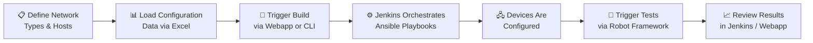
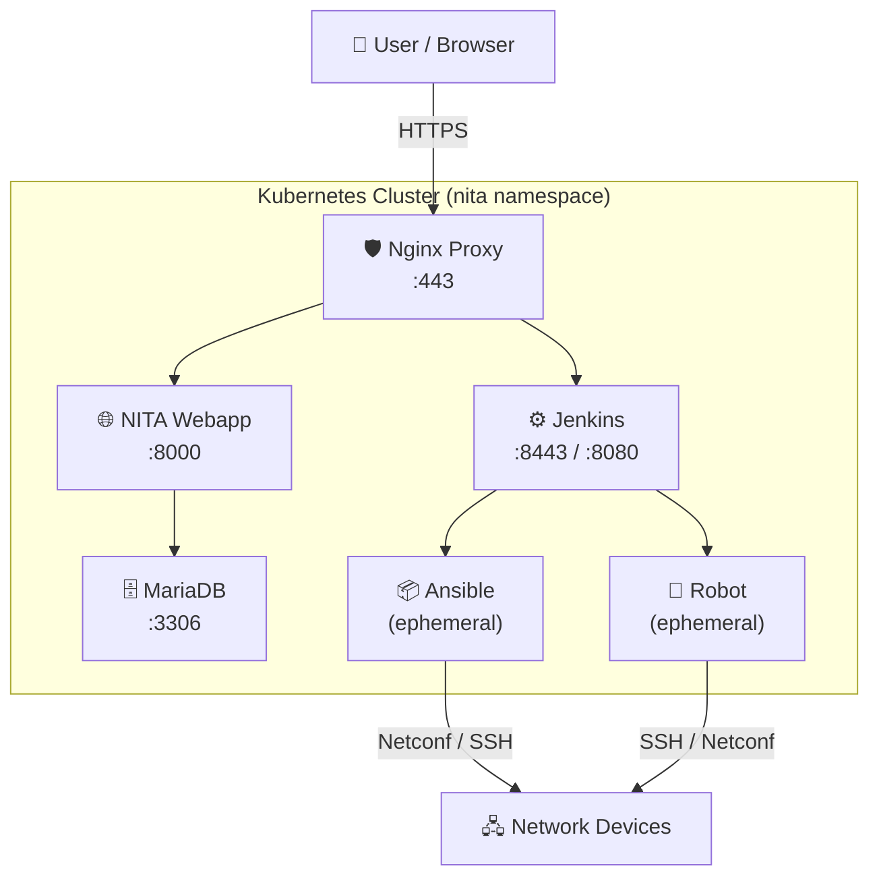

# :material-network-outline: NITA — Network Implementation & Test Automation

> **Version 23.12** · Open Source · MIT License · By [Juniper Networks](https://github.com/Juniper/nita)

---

## What is NITA?

**NITA** (Network Implementation and Test Automation) is an open-source platform purpose-built for **automating the deployment and testing of complex networks**. Originally developed by the Professional Services team at Juniper Networks in 2015, NITA has evolved into a battle-tested toolbox that enables network engineers to:

- :material-cog-sync: **Automate configuration deployment** across multi-vendor network fabrics
- :material-test-tube: **Execute automated tests** to validate network state and correctness
- :material-layers-triple: **Orchestrate complex workflows** spanning build, test, and Day-2 operations
- :material-docker: **Leverage containerized tools** for portable, reproducible automation

NITA is **vendor-neutral** and can be used to build and test networks from any vendor in the market.

---

## Key Technologies

NITA brings together best-in-class automation tools into a single, cohesive platform:

| Technology | Role in NITA |
|---|---|
| :material-ansible: **Ansible** | Configuration change management & device provisioning |
| :material-pipe: **Jenkins** | Automation engine, job orchestration & pipeline control |
| :material-robot: **Robot Framework** | Automated network testing & validation |
| :material-kubernetes: **Kubernetes** | Container orchestration & platform infrastructure |
| :material-database: **MariaDB** | Persistent data storage for projects & networks |
| :material-web: **NITA Webapp** | Web UI for managing network types, networks & actions |
| :material-shield-lock: **Nginx** | Reverse proxy with TLS termination |

---

## How It Works

1. **Define** your network topology and device inventory
2. **Upload** configuration data using Excel spreadsheets
3. **Build** — Jenkins orchestrates Ansible playbooks to push configurations to devices
4. **Test** — Robot Framework executes automated validation tests
5. **Review** results through the NITA Webapp or Jenkins dashboards

---

## Platform Architecture at a Glance

---

## Example Projects

NITA ships with ready-to-use example projects to get you started:

| Example | Description |
|---|---|
| **EVPN VXLAN DC** | Build and test an EVPN VXLAN data centre fabric using Juniper QFX devices, with 14 Robot tests |
| **eBGP WAN** | Build and test a DC WAN topology based on IPCLOS and eBGP, with 13 Robot tests |
| **ChatGPT Integration** | Send failed test case descriptions to ChatGPT for AI-powered troubleshooting suggestions |

---

## Quick Links

- :material-download: **[Installation Guide](installation.md)** — Get NITA up and running in minutes
- :material-console: **[CLI Reference](cli-reference.md)** — Master the `nita-cmd` command line
- :material-cogs: **[Architecture](architecture.md)** — Deep dive into system design
- :material-test-tube: **[Example Projects](examples.md)** — Learn by doing with real-world examples
- :material-lifebuoy: **[Troubleshooting](troubleshooting.md)** — Fix common issues fast

---

## System Requirements

| Requirement | Minimum |
|---|---|
| **Operating System** | Ubuntu 22.04 LTS or AlmaLinux 9.3 Server |
| **Memory** | 8 GB free |
| **Storage** | 20 GB free |
| **Architecture** | x86_64 |
| **Access** | Root or sudo privileges |

---

## Community & Support

- :material-github: [GitHub Repository](https://github.com/Juniper/nita)
- :material-youtube: [NITA Introduction Video](https://www.youtube.com/watch?v=6edtVe8Ueis)
- :material-school: [Juniper Automation Training](https://learningportal.juniper.net/juniper/user_activity_info.aspx?id=10840)
- :material-file-document: [Contributing Guide](contributing.md)

---

!!! info "Open Source"
    NITA is released under the **MIT License**. You are free to use, modify, and distribute it.
    Contributions are welcome — see our [Contributing Guide](contributing.md).
