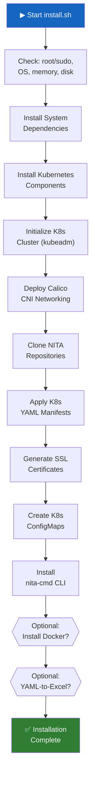

# :material-download: Installation & Setup

This guide walks you through installing NITA from scratch on a supported Linux system. The automated `install.sh` script handles all dependencies, Kubernetes setup, and NITA pod deployment.

---

## Prerequisites

| Requirement | Details |
|---|---|
| **Operating System** | Ubuntu 22.04.03 LTS **or** AlmaLinux 9.3 Server |
| **Architecture** | x86_64 |
| **Free Memory** | ≥ 8 GB |
| **Free Storage** | ≥ 20 GB (for all dependencies + pods) |
| **Access Level** | Root or user with `sudo` privileges |
| **Network** | Internet access for downloading packages and container images |

!!! warning "Unsupported Platforms"
    While NITA may work on other Linux distributions, only Ubuntu 22.04 LTS and AlmaLinux 9.3 have been extensively tested. macOS and Windows are not supported as host systems.

---

## Quick Install

The fastest way to install NITA is with the automated installation script:

```bash
# Download the install script
wget https://raw.githubusercontent.com/Juniper/nita/refs/heads/main/install.sh

# Make it executable
chmod 755 install.sh

# Run with sudo (preserving environment variables)
sudo -E ./install.sh
```

The script is interactive — it will prompt you at each stage:

```
install.sh: NITA install script.
Install system dependencies (y|n|q)? [y]
Install Kubernetes (y|n|q)? [y]
Initialise Kubernetes cluster (y|n|q)? [y]
Install NITA repositories (y|n|q)? [y]
Do you want to run Ansible as a standalone Docker container (y|n|q)? [y]
Do you want to install standalone yaml-to-excel tools (y|n|q)? [y]
```

Answer **Y** (or press Enter) for each step, **N** to skip, or **Q** to quit.

---

## Installation Steps in Detail

### Step 1: System Dependencies

The script installs essential system packages:

=== "Ubuntu"

    ```bash
    apt update -y
    apt install -y ca-certificates curl wget gnupg gnupg2
    apt install -y lsb-release software-properties-common apt-transport-https
    apt install -y openjdk-19-jre-headless
    apt install -y containerd.io git socat jq unzip
    ```

=== "AlmaLinux"

    ```bash
    dnf update -y
    dnf install -y ca-certificates curl wget gnupg gnupg2
    dnf config-manager --add-repo=https://download.docker.com/linux/centos/docker-ce.repo
    dnf install -y containerd.io git socat jq unzip
    ```

The `containerd` runtime is configured with SystemdCgroup enabled.

---

### Step 2: Kubernetes Installation

The script installs Kubernetes 1.28 components:

- Disables swap (required by Kubernetes)
- Configures kernel modules (`overlay`, `br_netfilter`)
- Installs `kubelet`, `kubeadm`, `kubectl`

---

### Step 3: Kubernetes Cluster Initialization

```bash
kubeadm init --control-plane-endpoint="localhost" --ignore-preflight-errors=NumCPU
```

After initialization:

- Calico CNI is deployed for pod networking
- Node taints are removed to allow scheduling on the control plane
- Firewall rules are configured (AlmaLinux)
- `KUBECONFIG` is exported

---

### Step 4: NITA Repository Installation

The script clones all NITA repositories to `$NITAROOT` (default: `/opt`):

```
/opt/nita          — Meta repository, K8s configs, examples
/opt/nita-webapp   — Webapp container source
/opt/nita-ansible  — Ansible container source
/opt/nita-jenkins  — Jenkins container source
/opt/nita-robot    — Robot container source
```

It then:

1. Applies all Kubernetes YAML manifests to create pods
2. Generates self-signed **Nginx SSL certificates**
3. Creates Kubernetes ConfigMaps for proxy configuration
4. Generates a **Jenkins keystore** (JKS) and certificate
5. Creates Kubernetes ConfigMaps for Jenkins certificates
6. Copies `KUBECONFIG` to the user's `~/.kube/config`
7. Installs `nita-cmd` CLI scripts to `/usr/local/bin`

---

### Step 5: Optional — Standalone Docker (Ansible)

If you want to run Ansible containers outside of Kubernetes:

```bash
dnf install -y docker-ce  # or apt install
usermod -aG docker <username>
```

---

### Step 6: Optional — YAML-to-Excel Tools

Installs Python-based tools for converting between YAML and Excel formats:

```bash
pip3 install ./nita-yaml-to-excel-main/
```

---

## Post-Installation

### Source Your Environment

After installation completes, source your shell configuration:

```bash
source ~/.bashrc
```

### Verify Installation

Wait 5–10 minutes for all pods to initialize, then verify:

```bash
# Check pod status
nita-cmd kube pods

# Expected output:
# NAME                       READY   STATUS    RESTARTS   AGE
# db-xxxxx                   1/1     Running   0          5m
# jenkins-xxxxx              1/1     Running   0          5m
# proxy-xxxxx                1/1     Running   0          5m
# webapp-xxxxx               1/1     Running   0          5m
```

### Access NITA

| Service | URL | Credentials |
|---|---|---|
| **NITA Webapp** | `https://<YOUR-NODE-IP>:443` | `vagrant` / `vagrant123` |
| **Jenkins** | `https://<YOUR-NODE-IP>:8443` | *(auto-configured)* |

---

## Environment Variables

Customize the installation by setting these environment variables **before** running `install.sh`:

| Variable | Default | Description |
|---|---|---|
| `NITAROOT` | `/opt` | Where NITA repositories are installed |
| `BINDIR` | `/usr/local/bin` | Where executables (nita-cmd) are installed |
| `BASH_COMPLETION` | `/etc/bash_completion.d` | Bash completion files location |
| `K8SROOT` | `$NITAROOT/nita/k8s` | Kubernetes YAML files location |
| `PROXY` | `$K8SROOT/proxy` | Nginx configuration location |
| `CERTS` | `$PROXY/certificates` | Nginx certificate files location |
| `JENKINS` | `/var/jenkins_home` | Jenkins keys and certificate files |
| `KEYPASS` | `nita123` | Passkey for self-signed Jenkins keys |
| `KUBEROOT` | `/etc/kubernetes` | Kubernetes configuration location |
| `KUBECONFIG` | `$KUBEROOT/admin.conf` | Kubernetes config file path |
| `DEBUG` | *(unset)* | Set to `true` for verbose output |
| `IGNORE_WARNINGS` | *(unset)* | Set to `true` to skip system warnings |

**Example:**

```bash
export NITAROOT=/home/user/nita
export KEYPASS=mysecurepassword
sudo -E ./install.sh
```

---

## Installation Flow



---

## Uninstalling NITA

To remove NITA and its Kubernetes cluster:

```bash
# Delete NITA namespace and all pods
kubectl delete namespace nita

# Reset Kubernetes
sudo kubeadm reset
sudo systemctl restart containerd.service

# Remove NITA files
sudo rm -rf /opt/nita /opt/nita-*
sudo rm -rf /var/nita_project
sudo rm -f /usr/local/bin/nita-cmd*
```
