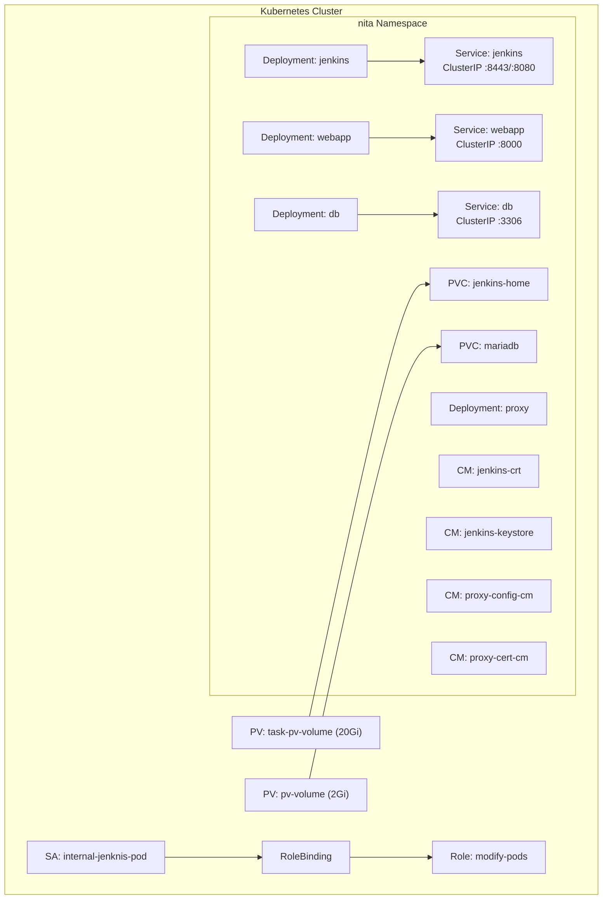

# :material-kubernetes: Kubernetes Operations

NITA runs within a single-node Kubernetes cluster. This page covers the Kubernetes resources, management commands, and operational procedures for the NITA infrastructure.

---

## Cluster Overview



---

## Common Commands

### Using `nita-cmd`

| Command | Description |
|---|---|
| `nita-cmd kube pods` | List all running NITA pods |
| `nita-cmd kube nodes` | List cluster nodes |
| `nita-cmd kube cm` | List ConfigMaps |
| `nita-cmd kube ns all` | List all namespaces |
| `nita-cmd kube version` | Show Kubernetes version |
| `nita-cmd kube cluster` | Show cluster info |

### Using `kubectl`

```bash
# List pods
kubectl get pods -n nita

# List deployments
kubectl get deployments -n nita

# List services
kubectl get services -n nita

# List persistent volumes
kubectl get pv

# List persistent volume claims
kubectl get pvc -n nita

# List ConfigMaps
kubectl get cm -n nita

# Describe a pod
kubectl describe pod <pod-name> -n nita

# View pod logs
kubectl logs <pod-name> -n nita

# Access a pod shell
kubectl exec -it -n nita <pod-name> -- bash
```

---

## Pod Management

### Restart a Deployment

```bash
kubectl rollout restart deployment/<name> -n nita
```

**Example:**

```bash
kubectl rollout restart deployment/jenkins -n nita
```

### Delete and Re-create a Deployment

```bash
kubectl delete deployment <name> -n nita
kubectl apply -f /opt/nita/k8s/<name>-deployment.yaml
sudo systemctl restart kubelet
```

### Scale a Deployment

```bash
kubectl scale deployment/<name> --replicas=<count> -n nita
```

---

## ConfigMap Management

### View a ConfigMap

```bash
kubectl get cm <name> -n nita -o yaml
```

### Update a ConfigMap

```bash
# Delete and recreate
kubectl delete cm <name> -n nita
kubectl create cm <name> --from-file=<source> --namespace nita

# Or use dry-run + apply
kubectl create cm <name> --from-file=<source> \
  --namespace nita --dry-run=client -o yaml | kubectl apply -f -
```

### NITA ConfigMaps

| ConfigMap | Source | Target Pod |
|---|---|---|
| `jenkins-crt` | `jenkins.crt` | Jenkins |
| `jenkins-keystore` | `jenkins_keystore.jks` | Jenkins |
| `proxy-config-cm` | `nginx.conf` | Proxy |
| `proxy-cert-cm` | Certificate directory | Proxy |

---

## Persistent Volume Management

### View Volumes

```bash
kubectl get pv
kubectl get pvc -n nita
```

### Expected Output

```
NAME             CAPACITY   ACCESS MODES   RECLAIM POLICY   STATUS   CLAIM
pv-volume        2Gi        RWO            Retain           Bound    default/mariadb
task-pv-volume   20Gi       RWO            Retain           Bound    default/jenkins-home
```

---

## RBAC Resources

Jenkins requires API access to launch ephemeral pods:

```bash
# View role
kubectl get role -n nita

# View service account
kubectl get sa -n nita

# View role binding
kubectl get rolebinding -n nita
```

---

## Certificate Renewal

Kubernetes certificates expire after one year. Check and renew:

```bash
# Check expiration
sudo kubeadm certs check-expiration

# Renew all certificates
sudo kubeadm certs renew all
sudo systemctl restart kubelet
```

!!! warning "Annual Renewal"
    Kubernetes certificate duration is hardcoded to 1 year in `kubeadm`. Set a calendar reminder to renew annually.

---

## Cluster Recovery

### Reset Kubernetes

If the cluster is in a bad state:

```bash
sudo kubeadm reset
sudo systemctl restart containerd.service
```

Then re-initialize:

```bash
sudo kubeadm init --control-plane-endpoint="localhost" --ignore-preflight-errors=NumCPU
export KUBECONFIG=/etc/kubernetes/admin.conf
kubectl taint nodes --all node-role.kubernetes.io/control-plane-
kubectl apply -f https://raw.githubusercontent.com/projectcalico/calico/v3.26.0/manifests/calico.yaml
```

### Re-deploy NITA

```bash
cd /opt/nita/k8s
bash apply-k8s.sh

# Re-create ConfigMaps
kubectl create cm proxy-config-cm --from-file=proxy/nginx.conf --namespace nita
kubectl create cm proxy-cert-cm --from-file=proxy/certificates/ --namespace nita
kubectl create cm jenkins-crt --from-file=/var/jenkins_home/jenkins.crt --namespace nita
kubectl create cm jenkins-keystore --from-file=/var/jenkins_home/jenkins_keystore.jks --namespace nita
```

---

## YAML Manifest Reference

All Kubernetes manifests are located at `/opt/nita/k8s/`:

| File | Type | Purpose |
|---|---|---|
| `nita-namespace.yaml` | Namespace | Creates the `nita` namespace |
| `pv.yaml` | PersistentVolume | 2Gi volume for MariaDB |
| `pv2.yaml` | PersistentVolume | 20Gi volume for Jenkins |
| `mariadb-persistentvolumeclaim.yaml` | PVC | Claims `pv-volume` |
| `jenkins-home-persistentvolumeclaim.yaml` | PVC | Claims `task-pv-volume` |
| `db-deployment.yaml` | Deployment | MariaDB pod |
| `db-service.yaml` | Service | MariaDB ClusterIP service |
| `jenkins-deployment.yaml` | Deployment | Jenkins pod |
| `jenkins-service.yaml` | Service | Jenkins ClusterIP service |
| `webapp-deployment.yaml` | Deployment | Webapp pod |
| `webapp-service.yaml` | Service | Webapp ClusterIP service |
| `proxy-deployment.yaml` | Deployment | Nginx proxy pod |
| `service-account.yaml` | ServiceAccount | Jenkins pod identity |
| `role-binding.yaml` | RoleBinding | Binds SA to Role |
| `cluster-role.yaml` | ClusterRole | Jenkins pod permissions |
| `storageClass.yaml` | StorageClass | Manual storage class |
| `calico.yaml` | CNI | Calico network plugin |
| `apply-k8s.sh` | Script | Applies all manifests |
