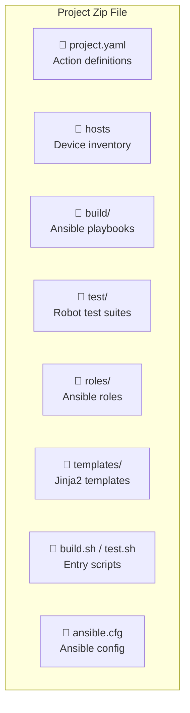
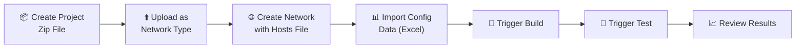

# :material-folder-cog: Projects & Workflows

Projects are at the heart of NITA — they define what devices to configure, how to configure them, and what tests to run. This page explains how to create, upload, and work with projects.

---

## What is a Project?

A NITA project is a **zip file** containing everything needed to automate the build and test of a network:



---

## Project Workflow



---

## Creating a Project

### Step 1: Define the Device Inventory

Create a `hosts` file using Ansible [INI format](https://docs.ansible.com/ansible/latest/user_guide/intro_inventory.html):

```ini
[all:children]
dc1
dc2

[dc1]
dc1-spine1
dc1-spine2

[dc2]
dc2-spine1
dc2-spine2
```

### Step 2: Create the Project Descriptor

The `project.yaml` file defines the actions available for your project:

```yaml
name: My Network Project
description: Automates spine device configuration

actions:
  - name: Build
    jenkins_url: my_project_build
    category: BUILD
    configuration:
      - shell_command: ./build.sh

  - name: Test
    jenkins_url: my_project_test
    category: TEST
    configuration:
      - shell_command: ./test.sh

  - name: NOOB
    jenkins_url: my_project_noob
    category: NOOB
    configuration:
      - shell_command: ./noob.sh
```

**Action Categories:**

| Category | What It Does | Container |
|---|---|---|
| `NOOB` | Initial device setup (New Out Of the Box) | Ansible |
| `BUILD` | Deploy configurations to devices | Ansible |
| `TEST` | Execute validation tests | Robot Framework |

### Step 3: Write Ansible Playbooks

Create the build playbook at `build/sites.yaml`:

```yaml
---
- import_playbook: ../make_clean.yaml
- import_playbook: ../make_etc_hosts.yaml

- hosts: all
  pre_tasks:
  connection: local
  roles:
    - { role: spine }

- hosts: all
  connection: local
  gather_facts: no
  roles:
    - { role: commit_config }
```

### Step 4: Create Jinja2 Templates

Templates generate device-specific configurations from inventory data:

```jinja
{# Template for Junos syslog configuration #}
system {
  syslog {
    
        host {{ base.syslog.loghost }} {
    
    
      
          {{ row.facility }} {{ row.level }};
      
        }
    
  }
}
```

### Step 5: Prepare Configuration Data (Excel)

NITA uses Excel workbooks to provide configuration values. A workbook typically contains these worksheets:

| Worksheet | Columns | Purpose |
|---|---|---|
| **base** | `host`, `name`, `value` | Global variables (Netconf credentials, ports) |
| **management_interface** | `host`, `management_interface` | Device management IP addresses |
| **Custom sheets** | Varies | Template-specific data (e.g., syslog, BGP) |

!!! info "Ordered Dictionaries"
    When multiple rows share the same key, use the `+` symbol in column names (e.g., `host+.facility`, `host+.level`) to tell NITA to parse them as ordered dictionaries.

### Step 6: Include Standard Files

Download these standard files from an existing example project:

| File | Purpose |
|---|---|
| `ansible.cfg` | Default Ansible settings |
| `build.sh` | Runs the Ansible playbook |
| `make_clean.yaml` | Resets build directories for each host |
| `make_etc_hosts.yaml` | Runs the hosts entry script |
| `make_hosts_entry.sh` | Updates `/etc/hosts` for devices |

### Step 7: Zip and Upload

```bash
zip -r my_project.zip my_project/
```

Upload through the NITA Webapp UI under **Network Types → Add**.

---

## Excel Data Formatting

### Base Data Sheet

| host | name | value |
|---|---|---|
| `all.yaml` | `netconf_user` | `admin` |
| `all.yaml` | `netconf_passwd` | `admin123` |
| `all.yaml` | `netconf_port` | `830` |

### Management Interface Sheet

| host | management_interface |
|---|---|
| `dc1-spine1.yaml` | `10.0.0.1` |
| `dc1-spine2.yaml` | `10.0.0.2` |

---

## Useful Tools

| Tool | URL | Purpose |
|---|---|---|
| YAML to JSON | [convertjson.com](https://www.convertjson.com/yaml-to-json.htm) | Convert YAML to JSON |
| Jinja2 Parser | [j2live.ttl255.com](https://j2live.ttl255.com) | Online Jinja2 renderer |
| YAML Parser | [codebeautify.org](https://codebeautify.org/yaml-parser-online) | Validate YAML syntax |
| JSON Formatter | [jsonformatter.org](https://jsonformatter.org/) | Format JSON data |
